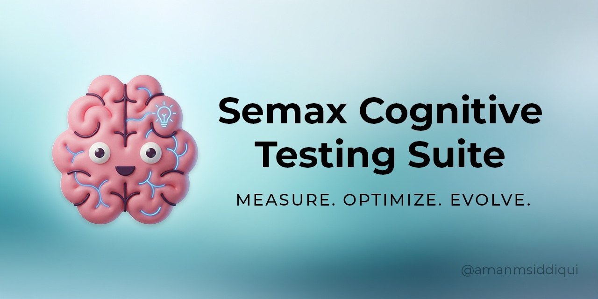

<div align="center">
  
</div>

**An open-source cognitive performance tracking platform designed for rigorous self-experimentation.**

Track objective cognitive changes over time using AI-powered testing, automated data logging, and interactive visualizations.

[](https://www.python.org/downloads/)
[](https://streamlit.io)
[](https://opensource.org/licenses/MIT)

---

## 📋 Table of Contents

- [Overview](#-overview)
- [Why This Exists](#-why-this-exists)
- [Features](#-features)
- [Installation](#-installation)
- [API Key Setup](#-api-key-setup)
- [How to Use](#-how-to-use)
- [Data & Privacy](#-data--privacy)
- [Daily Testing Protocol](#-daily-testing-protocol)
- [Test Details](#-test-details)
- [Troubleshooting](#-troubleshooting)
- [Tech Stack](#-tech-stack)
- [License](#-license)

---

## 🎯 Overview

The **Semax Cognitive Testing Suite** is a comprehensive testing platform that combines validated cognitive assessments with modern AI to track mental performance over time. Originally built for personal N=1 experimentation with Semax (a nootropic peptide), it's now available as an open-source tool for anyone tracking cognitive interventions.

**What makes this different:**
- ✅ **AI-powered grading** - Whisper Turbo (speech-to-text) + Gemini 3.0 Flash Coverage (evaluation)
- ✅ **Validated tests** - Stroop, Digit Span, Verbal Fluency used in clinical research
- ✅ **Longitudinal tracking** - CSV export + interactive visualizations
- ✅ **Privacy-first** - All data stays on your machine
- ✅ **Free & open-source** - MIT license, no subscriptions

---

## 💡 Why This Exists

**The Problem:**
Most cognitive testing platforms are either expensive subscription services, closed-source with unclear methodology, or require manual scoring. They aren't designed for the rigorous, daily self-tracking needed to evaluate biohacks or nootropics.

**The Solution:**
This suite provides **scientifically-validated cognitive tests** with **automated AI scoring** that you can run daily from your laptop. Use it to track the effects of:
- Nootropics (Semax, Racetams, etc.)
- Supplements (Creatine, Omega-3s)
- Lifestyle changes (Sleep, Diet, Exercise)
- Medications (ADHD meds, SSRIs)
- Meditation practices

**Built for systems thinkers who want objective data on what actually works.**

---

## ✨ Features

### 🩺 Phase 1: Vitals & Context
- Blood pressure, heart rate, SpO2
- Sleep metrics (duration, REM, deep)
- Hours since dose/intervention
- Subjective voice notes (transcribed)

### 🎨 Phase 2: Stroop Test (Executive Function)
- Classic color-word interference paradigm
- Measures cognitive control and processing speed
- **Calculates interference score** (Incongruent RT - Congruent RT)
- **50 words total** (25 congruent, 25 incongruent)

### 🗣️ Phase 3: Verbal Fluency (Language & Speed)
- Word generation task
- Random letter assignment (F, A, S, etc.)
- **Graded by AI** (Gemini) to validate words and remove duplicates
- Transcript saved for review

### 🔢 Phase 4: Digit Span (Working Memory)
- Reverse digit recall (the gold standard for working memory)
- Adaptive difficulty: starts at 5 digits, increases upon success
- **Voice recognition** via Whisper Turbo for hands-free testing
- Tracks max span, total attempts, and timing

### 📚 Phase 5: Abstract Synthesis (Reasoning)
- Random arXiv paper abstract (CS, Math, Physics)
- Verbal explanation of content
- **AI Grading** (0-10 score) on comprehension and synthesis coverage

### 📊 Phase 6: Data Logging
- Automatic local CSV export (`semax_cognitive_log.csv`)
- Interactive trend graphs using Plotly
- Tracks progression over days/weeks

---

## 🚀 Installation

### Prerequisites
- **Python 3.11+** ([Download](https://www.python.org/downloads/))
- **Internet connection** (first run only - downloads models)
- **~2GB+ free disk space** (for Whisper Turbo model cache)
- **Microphone**

### Step 1: Clone the Repository
```bash
git clone https://github.com/amanmsiddiqui/semax-cognitive-testing.git
cd semax-cognitive-testing
```

### Step 2: Install Dependencies
```bash
pip install -r requirements.txt
```

**What gets installed:**
- `streamlit` - Web app framework
- `openai-whisper` - Speech-to-text (**Turbo model**, ~1.5GB download)
- `google-genai` - Google's Python SDK for Gemini API
- `pandas` - Data manipulation
- `plotly` - Interactive visualizations
- `torch` - PyTorch backend
- `python-dotenv` - Environment variable management

### Step 3: Set Up API Key
🔑 **Required:** Follow [API Key Setup](#-api-key-setup) below.

### Step 4: Run the App
```bash
streamlit run app.py
```

**First Run Warning:**
The app will download the **Whisper Turbo** model (~1.5GB). This happens automatically on the first launch and can take a few minutes depending on your internet speed. Subsequent runs will be instant.

---

## 🔑 API Key Setup

This app uses Google's **Gemini API** (free tier) for grading.

### 1. Get Your Free Key
1. Go to [Google AI Studio](https://ai.google.dev/)
2. Sign in and click **"Get API Key"**
3. Create a key and copy it.

### 2. Add to Your App
**Option A: Streamlit Secrets (Recommended)**
Create a file at `.streamlit/secrets.toml` inside your project folder:
```toml
GEMINI_API_KEY = "AIzaSyC...your_actual_key_here"
```
*(Note: Create the `.streamlit` folder if it doesn't exist.)*

**Option B: .env File**
Create a `.env` file in the project root:
```env
GEMINI_API_KEY=AIzaSyC...your_actual_key_here
```

---

## 📖 How to Use

### Daily Protocol
1. **Consistency is key:** Test at the same time daily (e.g., morning).
2. **Environment:** Quiet room, minimal distractions.
3. **Workflow:**
    - Enter vitals.
    - Run through all 5 phases.
    - Review results on the dashboard.
    - **Refresh** the page to start a new session (do not use browser back button).

---

## 🔒 Data & Privacy

**100% Local Storage.**
- All data is saved to `semax_cognitive_log.csv` on your computer.
- **Privacy:** No personal data is sent to the cloud.
- **API Usage:** Only audio transcripts are sent to Google Gemini for grading. No audio files are uploaded.
- **Audio Processing:** Whisper runs **locally** on your machine.

---

## ❓ Troubleshooting

### "Failed to load Whisper model"
- Ensure you have ~2GB free disk space.
- Check your internet connection (OpenAI servers might be blocked).
- Try running `python -c "import whisper; whisper.load_model('turbo')"` in your terminal to debug the download.

### "ImportError: No module named 'google.genai'"
- Run `pip install -r requirements.txt` again. We recently switched from `google-generativeai` to the newer `google-genai` SDK.

### Slow Transcription
- **CPU Users:** Transcription might take 10-30 seconds. This is normal.
- **GPU Users:** If you have an NVIDIA GPU, ensure you have the correct CUDA toolkit installed for PyTorch to use it. The app automatically detects CUDA if available.

### Gemini API Errors (400, 429, 503)
- **400:** check your API key.
- **429:** You hit the free quota (rate limit). Wait a minute.
- **503:** Service temporary unavailable. Retry the test.

---

## 🛠️ Tech Stack

- **Frontend:** Streamlit
- **Speech-to-Text:** OpenAI Whisper (**Turbo** model)
- **AI Grading:** **Gemini 3.0 Flash** (via `google-genai`)
- **Visualizations:** Plotly Interactive Charts

---

## 📜 License

**MIT License** - Free to use, modify, and distribute options.

---

## ⚠️ Disclaimer

**For Research & Informational Purposes Only.**
This software is designed for self-experimentation and data tracking. It is **not** a medical device and does not provide medical advice. The cognitive scores and vital tracking features should not be used to diagnose, treat, or cure any medical condition. Always consult with a healthcare professional before starting any new supplement, nootropic, or exercise protocol.
